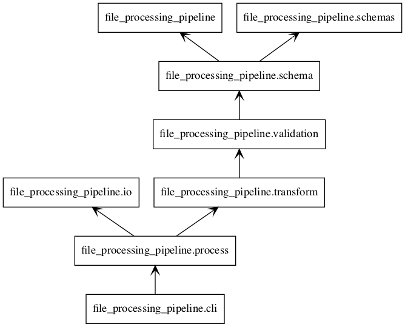

## Pre-requisites

- [python 3.7+](https://www.python.org/downloads/)
- [gnu make](http://ftp.gnu.org/gnu/make/)

These probably already exist on your machine, so don't reinstall unless needed.

#### Optional

- For generating module diagrams: [graphiz](https://graphviz.gitlab.io/download/)

## Development/Test setup

Make a virtual environment:
```bash
mkvirtualenv -p python3 file-processing-pipeline # or your preferred way to create a virtual environment
```

Install dependencies for development and run time:
```bash
make init-dev
```

## Package diagram



## Misc
### How to create a big file

(cd test/resources/; python make_big_file.py; wc -l input_root/big/end_of_day.csv)
